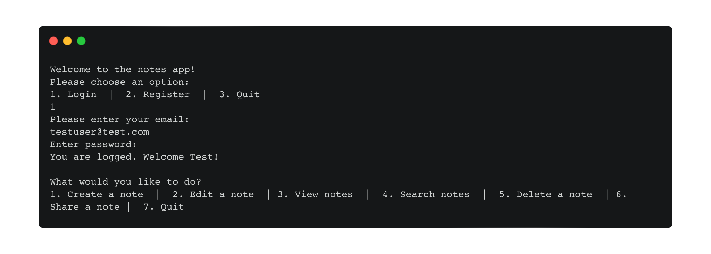

# CPSC 312 Project 1 - Notes App
By: Kavpreet Grewal, Zahra Raza, and Amy Perna



## Overview

This is a quick, easy to use terminal-based notes app that allows users to create, edit, delete, search, share notes, and more. It is written entirely in Haskell and uses SQLite as a database.

## Features

- Login and register users
- Create, edit, and delete notes
- Search for notes by a search term or phrase
- Share notes with other users
- View detailed stats about a note, such as the word count and the most frequently used words

## Usage

### Installation

To install the notes app, clone this repository and run the following command in the root directory:

```stack run```

Note: You must have [Stack](https://docs.haskellstack.org/en/stable/README/) installed to run this command.

### Commands

The following commands are available in the notes app:
- `1` - Create a new note. You will be prompted to enter a title and body for the note which will be saved to the database for the user.
- `2` - Edit an existing note. You will be prompted to enter the title of the note you wish to edit. You will then be prompted to enter a new title and body for the note which will replace the old note.
- `3` - View a list of all notes. You can select a note to view the note and detailed stats about the note (ex. word count and most frequently used words).
- `4` - Search for an existing note. You will be prompted to enter a search term or phrase. All notes containing the search term or phrase will be listed.
- `5` - Delete an existing note. You will be prompted to enter the title of the note you wish to delete. The note will be removed from the database.
- `6` - Share an existing note. You will be prompted to enter the title of the note you wish to share and then the email address of the user you wish to share the note with. The note will be shared with the user and they will be able to view it in their notes app.

## License
Shield: [![CC BY 4.0][cc-by-shield]][cc-by]

This work is licensed under a
[Creative Commons Attribution 4.0 International License][cc-by].

[![CC BY 4.0][cc-by-image]][cc-by]

[cc-by]: http://creativecommons.org/licenses/by/4.0/
[cc-by-image]: https://i.creativecommons.org/l/by/4.0/88x31.png
[cc-by-shield]: https://img.shields.io/badge/License-CC%20BY%204.0-lightgrey.svg